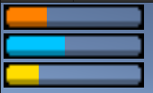

# Features:
## Blackboard:

DaniGotchii is a student Unity project made to learn how to build and customize an Utility System IA. The project had for purpose to create a reproduction of a Tamagotchii with fully customizable personnality and needs in editor.

    

    
    
    

The parameters used for the customization and IA setting of the DaniGotchii are set in a Blackboard component in which you can set a list of variables with a name and a float value.

    

 

## DaniGotchii

You can set a list of needs for the DaniGotchii and you can set the duration needed for the value to reach 1. They must have the same name as the value in the blackboard for the IA to access these Data. The Danigotchii component will update those value in runtime decreasing or increasing them.

    

## DaniGotchii Interaction Manager

You can interact with the needs of a Danigotchii with the helps of an interaction Manager. it allows to create a list of interaction that can fill the needs of the DaniGotchii. The player can interact with the DaniGotchii with dropdowns to select the function, and click on the button associate to call the function.

    

The InteractButton component is a UI object that takes an InteractionManager as parameters and allow to call the interaction created in it.

    

## Status

Indicate the current value of the needs.

    

## Utility System

The Utility system works with a AI_UtilitySystem component and AI_UtilityState

    

The AI_UtilitySystem works by selecting the AI_UtilityState that has the higher priority.
The AI_UtilityState that must be inherited to set the priority calcul and function to do while the state is active.

The UtilityState is override with AI_UtilityStateBlackboard which use a variable in the blackboard and a graph function to determine the priority.
It also use events to call functions when the state is setup and while it's used.

    

 ## Math function

The Utility system use several mathematical function to determine the current state :

- Linear
- Exponential
- Sigmoid
- Logistic
- logarithmic
- AnimationCurve

Those function are located in GraphFunction.cs

## Credit
- FIGEIREDO Alex
- PETIT Denis
